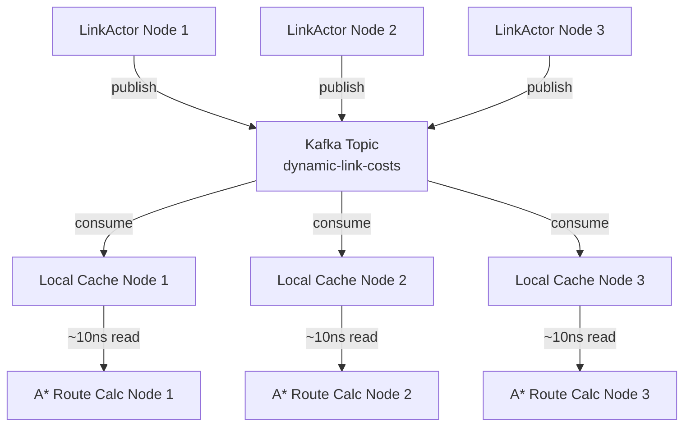

# Kafka-Based Dynamic Routing Architecture

## 🎯 Problem Solved

**Challenge:** O cálculo de rota (A*/Dijkstra) precisa de:
- ✅ Dados estáticos do grafo (distância, topologia) → replicado em memória
- ❌ Pesos dinâmicos (congestionamento, acidentes) → estava no LinkActor sharded

**Conflict:** 
- LinkActor tem estado real mas está sharded
- A* roda localmente e consulta milhares de links por rota
- ask() durante A* seria catastrófico para performance

## 🚀 Kafka Solution

### Architecture Flow



### Components

1. **LinkActor (Publisher)**
   - Atualiza estado interno (fila, veículos, congestionamento)
   - A cada N ticks, publica `DynamicLinkCost` para Kafka topic
   - Async, non-blocking (performance preservada)

2. **Kafka Topic: `dynamic-link-costs`**
   - Particionado por linkId (scale horizontal)
   - Retention: 5 minutos (tráfego muda rápido)
   - Compressão snappy (eficiência)

3. **Consumer Thread (cada nó)**
   - Consome todas as atualizações de custo
   - Atualiza `ConcurrentHashMap` local
   - Background, não bloqueia operações

4. **GPSUtil + A* Algorithm**
   - Acessa cache local (sub-microsegundo)
   - Fallback para peso estático se não encontrar
   - Zero impacto de rede durante cálculo

## ⚡ Performance Benefits

| Aspect | Before (Redis) | After (Kafka) |
|--------|---------------|---------------|
| Route calc speed | ~1ms per link lookup | ~10ns per link lookup |
| Network calls during A* | 1000s of Redis queries | 0 (pure local memory) |
| Consistency | Immediate | Eventually (~100ms lag) |
| Realism | Artificial perfection | Real-world traffic lag |
| Scalability | Redis bottleneck | Kafka horizontal scale |

## 🏗️ Implementation

### Configuration

```conf
htc {
  routing {
    cache-strategy = "kafka"  # kafka | redis | inmemory
  }
  kafka {
    bootstrap.servers = "localhost:9092"
    topic.dynamic-costs {
      name = "dynamic-link-costs"
      partitions = 12
      retention.ms = 300000  # 5 minutes
    }
  }
}
```

### Code Changes

1. **New KafkaCacheStrategy**
   - Implements `WeightCacheStrategy` interface
   - Background Kafka consumer thread
   - Local `ConcurrentHashMap` for ultra-fast reads

2. **Updated DynamicWeightCache**
   - Kafka as default strategy
   - Same interface, different backend

3. **Enhanced Link Actor**
   - Publishes dynamic costs to Kafka topic
   - Configurable publish interval

## 🌐 Realistic Traffic Behavior

### Eventual Consistency = Real World

Na vida real:
- Waze/Google Maps têm lag de dados
- Informação de trânsito nunca é 100% atual
- Motoristas tomam decisão com dados ligeiramente desatualizados

Nossa solução:
- ✅ Aceita lag de ~100ms (realístico)
- ✅ Performance de memória local
- ✅ Consistência eventual entre nós
- ✅ Fault tolerance via Kafka replay

## 📊 Monitoring

### Statistics Available

```scala
val (cacheSize, avgAge, publishCount) = DynamicWeightCache.getStatistics()
println(s"Cache: $cacheSize links, avg age: ${avgAge}s, published: $publishCount")

val (published, consumed, lastUpdate) = kafkaStrategy.getConsumerStatistics()
println(s"Kafka: published=$published, consumed=$consumed, last=${new Date(lastUpdate)}")
```

### Performance Metrics

- **Cache hit rate:** Should be >95% for active links
- **Publish rate:** Configurable per LinkActor
- **Consumer lag:** Should be <100ms
- **Memory usage:** ~1KB per active link

## 🔧 Operational Benefits

### Auto-Scaling
- Kafka partitions scale with cluster size
- Each node maintains full local cache
- No single point of failure

### Debugging
- Kafka topic retains events for replay
- Easy to inspect published costs
- Consumer offset tracking

### Configuration
- Zero code change to switch strategies
- Environment-specific tuning
- Gradual rollout possible

## 🚦 Next Steps

1. **Deploy Kafka cluster** with appropriate partitioning
2. **Configure LinkActors** to publish at optimal frequency  
3. **Monitor cache hit rates** and consumer lag
4. **Tune retention policy** based on traffic patterns
5. **Add incident simulation** for emergency routing

This architecture delivers the performance of local memory with the consistency of distributed state, perfectly matching real-world traffic information systems.