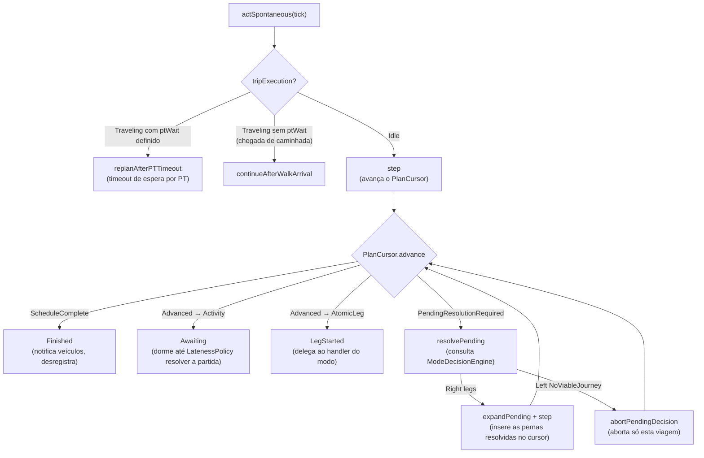
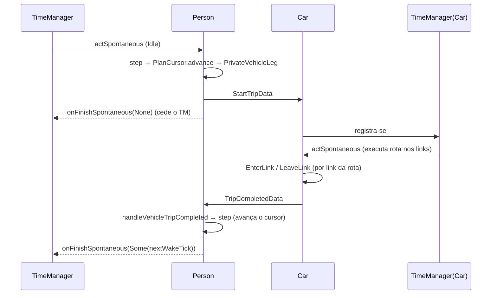
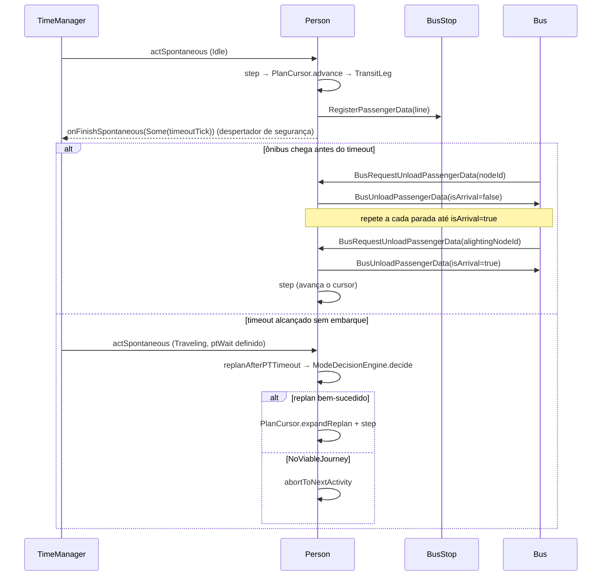

# Agente Pessoa (`Person`) — Documentação Técnica

> Pacote: `model.hybrid.actor.Person`
> Arquivo principal: [src/main/scala/model/hybrid/actor/Person.scala](../src/main/scala/model/hybrid/actor/Person.scala)

> **Nota de manutenção:** este documento descreve o modelo de plano/mode-choice pós-redesenho
> (plano plano de `PlanElement`s + `PlanCursor` + `ModeDecisionEngine`). O modelo anterior
> (`dailySchedule: List[Activity]` + `currentActivityIndex`, `ArrivalLogistics` como schema de
> entrada do `Person`, `ModeChoiceUtil`/`UtilityModeChoiceStrategy` como única via de escolha
> dinâmica, `PersonTripManager`/`PersonActivityManager`/`PersonScheduleManager`) foi removido por
> completo, sem retrocompatibilidade. `docs/diagrams/PERSON_AGENT.drawio` ainda reflete esse
> modelo antigo — é um arquivo XML que não é editável à mão de forma confiável, então **não foi
> atualizado**; os diagramas abaixo são Mermaid, inline, e são a versão atual. Se alguém depender
> do `.drawio` como fonte visual, ele precisa ser reconstruído do zero.

---

## 1. Visão Geral

O `Person` é um ator de simulação baseado em agentes que representa um indivíduo ao longo de um
dia de simulação. Diferentemente dos veículos, que são ativados sob demanda, **o agente Person
persiste durante todo o ciclo simulado**, executa um **plano** de atividades e pernas de viagem,
toma decisões de modo de transporte e coordena a comunicação com veículos e transporte público.

### Princípio fundamental

O modelo é **centrado na pessoa**: cada Person é a entidade decisora, e os veículos (Car,
Bicycle, Motorcycle) são **ativos passivos** que a Person ativa conforme necessário. Essa
separação garante que a lógica de mobilidade (rotas, escolha modal, histórico de viagens) fique
encapsulada no agente Person, enquanto a física do movimento fica nos veículos.

### O modelo em uma frase

O plano de uma pessoa é uma **lista plana e única** de elementos (`PlanElement`) — atividades,
pernas de viagem já resolvidas, e decisões de modo pendentes — e o `Person` avança essa lista
**um elemento por vez** através de um `PlanCursor`, delegando cada perna ao handler do seu modo e
resolvendo cada decisão pendente através de um `ModeDecisionEngine` plugável no momento em que ela
é alcançada (não antecipadamente).

---

## 2. Hierarquia de Classes

```
SimulationBaseActor[PersonState]
    └── Person
```

`Person` herda de `SimulationBaseActor` com parâmetro de tipo `PersonState`, recebendo:

- `actSpontaneous(event)` — chamado pelo TimeManager no tick agendado.
- `actInteractWith(event)` — chamado quando outro ator envia uma mensagem.
- `onFinishSpontaneous(nextTick)` — agenda o próximo tick (`Some(tick)`) ou desregistra (`None`).

Toda a lógica de orquestração do plano vive fora do ator, em
[`PersonPlanManager`](../src/main/scala/model/hybrid/support/person/PersonPlanManager.scala)
(uma classe *stateless*, sem referência ao Pekko) — `Person` apenas traduz eventos em chamadas a
esse manager e aplica o `PlanStepResult` retornado.

---

## 3. Modelo de Plano (`model.hybrid.entity.state.plan`)

> Arquivo principal: [src/main/scala/model/hybrid/entity/state/plan/PlanElement.scala](../src/main/scala/model/hybrid/entity/state/plan/PlanElement.scala)

O plano de uma pessoa não é mais uma lista de `Activity` com um índice — é uma lista de
`PlanElement`, um `sealed trait` com cinco formas concretas:

```scala
sealed trait PlanElement                      // topo da hierarquia
sealed trait ExecutedElement extends PlanElement   // tudo que já é executável
sealed trait AtomicLeg extends ExecutedElement { def mode: ConcreteMode }

final case class Activity(
  activityType: String,
  nodeId: String,
  endTime: EndTimeSpec
) extends ExecutedElement

final case class WalkLeg(
  originNodeId: String,
  destinationNodeId: String,
  precomputedRoute: Option[List[(String, String)]] = None
) extends AtomicLeg { val mode = ConcreteMode.Walk }

final case class PrivateVehicleLeg(
  mode: ConcreteMode,               // Car | Bicycle | Motorcycle
  vehicle: Identify,                // nunca opcional — tipo garante que a perna sempre tem veículo
  driverAttributes: DriverAttributes = DriverAttributes()
) extends AtomicLeg

final case class TransitLeg(
  mode: ConcreteMode,               // Bus | Subway
  line: String,
  boardingStop: StopRef,
  alightingStop: StopRef
) extends AtomicLeg

final case class PendingDecision(decision: ModeDecisionRequest) extends PlanElement
```

### A garantia central: `PendingDecision` nunca é `ExecutedElement`

`ExecutedElement` inclui `Activity` e todo `AtomicLeg`, mas **deliberadamente não inclui**
`PendingDecision`. Isso não é um detalhe de nomenclatura: é o que torna **erro de compilação**
colocar uma decisão de modo ainda não resolvida em `PlanCursor.executed` (uma lista tipada como
`List[ExecutedElement]`). Combinado com o `-Wconf:msg=match may not be exhaustive:error` do
`build.sbt` (ver seção 9), qualquer `match` sobre `PlanElement` que esqueça de tratar
`PendingDecision` também não compila. Essas duas garantias juntas são o motivo pelo qual esse
redesenho elimina uma classe inteira de bugs "esqueci de tratar a decisão pendente" que só
apareceriam em runtime no modelo antigo.

### `ConcreteMode` e `StopRef`

```scala
enum ConcreteMode:
  case Walk, Car, Bicycle, Motorcycle, Bus, Subway

final case class StopRef(actorId: String, actorClassType: String, nodeId: String)
```

`ConcreteMode` só rotula modos já resolvidos e executáveis — nunca uma escolha pendente. `StopRef`
é uma referência a ator (id + classType + nó), nunca um `ActorRef`, seguindo a regra do projeto de
que estado de simulação não pode carregar referências de ator vivas.

### `EndTimeSpec` e `LatenessPolicy`

```scala
sealed trait EndTimeSpec
final case class AtTick(tick: Tick) extends EndTimeSpec       // termina num tick absoluto
final case class Duration(ticks: Tick) extends EndTimeSpec    // termina N ticks após a chegada

trait LatenessPolicy {
  def resolveDepartureTick(spec: EndTimeSpec, arrivalTick: Tick): Tick
}

object MinimumDwellLatenessPolicy extends LatenessPolicy {
  def resolveDepartureTick(spec: EndTimeSpec, arrivalTick: Tick): Tick = spec match {
    case AtTick(tick)    => math.max(arrivalTick + 1, tick)
    case Duration(ticks) => arrivalTick + ticks
  }
}
```

`endTime` não é mais uma string a ser parseada em runtime (`"28800"` ou `"HH:MM"`) — é um tipo
`EndTimeSpec` com dois construtores explícitos, e é o `LatenessPolicy` (não o `Person`, não o
`PersonState`) quem decide o tick real de partida a partir do tick real de chegada.
`MinimumDwellLatenessPolicy` é **stateless**: a mesma dupla `(spec, arrivalTick)` sempre resolve
para o mesmo tick de partida — nunca acumula um offset em algum outro lugar.

> **O que isso substitui:** o antigo `scheduleDelayOffsetTicks` era um contador de atraso
> acumulado, aplicado como *ratchet* silencioso a todos os `endTime` futuros do cronograma —
> confundia "tempo gasto na viagem" com "atraso", e um atraso em uma atividade vazava para todas
> as atividades seguintes de forma difícil de auditar. Esse campo **não foi substituído por nada
> equivalente**: `MinimumDwellLatenessPolicy` resolve isoladamente, atividade por atividade, sem
> estado global de atraso.

### `PlanCursor` e `RemainingQueue`

```scala
final case class PlanCursor(executed: List[ExecutedElement], remaining: RemainingQueue)

sealed trait AdvanceResult
final case class Advanced(cursor: PlanCursor) extends AdvanceResult
final case class ScheduleComplete(cursor: PlanCursor) extends AdvanceResult
final case class PendingResolutionRequired(pending: PendingDecision, cursorWithoutHead: PlanCursor)
    extends AdvanceResult

object PlanCursor {
  def advance(cursor: PlanCursor): AdvanceResult                                   // dequeue + classifica
  def expandPending(pr: PendingResolutionRequired, resolved: List[AtomicLeg]): PlanCursor  // resolve a decisão
  def expandReplan(cursor: PlanCursor, newLegs: List[AtomicLeg]): PlanCursor        // troca a corrida atual
}
```

`PersonState.cursor` é a **única fonte de verdade** de "em que atividade/perna a pessoa está
agora" — substitui o par antigo `dailySchedule: List[Activity]` + `currentActivityIndex: Int`.
`PersonState.originalPlan` continua existindo, mas só para proveniência/depuração (relatar o que
foi originalmente planejado vs. o que de fato executou após replans); **não é ele que dirige a
execução**.

`RemainingQueue` (a cauda ainda-não-executada do plano) expõe deliberadamente **só** `dequeue` e
`prepend` — nunca um `append`/`enqueue` de cauda. Essa assimetria é proposital: é o que torna
impossível inserir uma expansão de mode-choice em qualquer lugar que não seja exatamente onde a
`PendingDecision`/corrida replanada estava, prevenindo inserção fora de ordem.

`RemainingQueue.dropCurrentLegRun` separa a corrida contígua de `AtomicLeg`s na cabeça da fila
(parando na primeira `Activity`) — é a operação usada tanto para abortar uma viagem em andamento
quanto para trocar apenas as pernas restantes de uma corrida ao replanejar.

---

## 4. Estado (`PersonState`)

> Arquivo: [src/main/scala/model/hybrid/entity/state/PersonState.scala](../src/main/scala/model/hybrid/entity/state/PersonState.scala)

```scala
case class PersonState(
  startTick: Tick = 0L,
  scheduleOnTimeManager: Boolean = true,

  originalPlan: List[PlanElement] = List.empty,          // plano exatamente como carregado — imutável
  cursor: PlanCursor = PlanCursor(Nil, RemainingQueue(Nil)),  // posição real de execução

  tripExecution: TripExecutionState = TripExecutionState.Idle, // substitui ~15 campos soltos

  ownedVehicles: Map[String, Identify] = Map.empty,       // modo -> Identify(id, classType)
  vehicleCurrentNode: Map[String, String] = Map.empty,    // modo -> nó onde o veículo está estacionado

  totalDistanceTraveled: Double = 0.0,
  completedTrips: Int = 0,

  ptWaitTimeoutTicks: Long = 86400L,                      // timeout de espera por PT (1 dia por padrão)
  modeChoiceWeights: ModeChoiceWeights = ModeChoiceWeights()
)
```

### O que desapareceu, e por quê

| Campo antigo | Substituído por |
|---|---|
| `dailySchedule: List[Activity]` | `originalPlan: List[PlanElement]` (proveniência) + `cursor: PlanCursor` (execução) |
| `currentActivityIndex: Int` | posição implícita em `cursor.executed`/`cursor.remaining` |
| `currentTripVehicleId`, `currentTripStartTick`, `ptAlightingNodeId`, `ptLine`, `ptWaitingSince`, `pendingTransferLegs`, `currentPhysicalNodeId`, `currentTripMode`, `currentTripId`, `currentTripDepartureTick`, `currentTripExpectedDistance`, `currentTripWaitTime`, `currentTripDestinationNodeId`, … (~15 campos) | um único `tripExecution: TripExecutionState` (ver seção 5) |
| `enableDynamicModeChoice: Boolean` | não existe mais um interruptor global "estático vs. dinâmico" — todo mode-choice passa por um `ModeDecisionEngine` nomeado quando o plano contém uma `PendingDecision`; um leg já concreto (`AtomicLeg`) no plano original nunca é reavaliado |

### `vehicleCurrentNode`

Novo campo: rastreia em qual nó da rede viária cada veículo privado próprio está estacionado
(`mode -> nodeId`). Quando ausente para um modo, o veículo é assumido como estando no nó da
atividade atual da pessoa (ex.: início do dia). Atualizado após cada perna de veículo privado, de
modo que um carro deixado em casa fica indisponível a partir do trabalho —
[`PrivateVehicleCandidates.available`](../src/main/scala/model/hybrid/decision/PrivateVehicleCandidates.scala)
filtra os candidatos com base nisso.

### Métodos de estado

| Método | Comportamento |
|---|---|
| `currentPhysicalNodeId` | Nó onde a pessoa está fisicamente agora — `tripExecution.physicalNodeId` se `Traveling`, ou o `nodeId` da última `Activity` executada se `Idle` |
| `isScheduleComplete` | `true` quando `tripExecution == Idle` **e** `cursor.remaining.isEmpty` |
| `completeTrip(dist)` | Registra a conclusão de uma corrida contígua: incrementa `completedTrips`, soma `dist` a `totalDistanceTraveled`, volta a `tripExecution = Idle` |
| `withInternedStrings` | Retorna cópia com strings de alta duplicação (tipos de atividade, node IDs, nomes de linha, IDs de parada) trocadas por instâncias `StringPool` compartilhadas |

---

## 5. `TripExecutionState` — o que substitui os ~15 campos soltos

> Arquivo: [src/main/scala/model/hybrid/entity/state/TripExecutionState.scala](../src/main/scala/model/hybrid/entity/state/TripExecutionState.scala)

```scala
sealed trait TripExecutionState

object TripExecutionState {
  case object Idle extends TripExecutionState   // dwelling numa Activity, ou plano ainda não começou

  final case class Traveling(
    physicalNodeId: String,                     // nó físico atual da pessoa
    tripId: String,                              // compartilhado por todas as pernas da mesma corrida
    legStartTick: Tick,                          // tick em que a perna atual começou
    ptWait: Option[PTWaitState] = None,          // presente só enquanto espera embarque em PT
    replanStrategyId: String = "travel-time",    // engine a reconsultar se essa corrida der timeout de PT
    replanAllowedModes: Set[ConcreteMode] = ConcreteMode.values.toSet,
    accumulatedDistance: Double = 0.0            // distância real acumulada na corrida atual
  ) extends TripExecutionState
}

final case class PTWaitState(
  waitingSinceTick: Tick,
  timeoutTick: Tick,
  alightingNodeId: String,
  line: String
)
```

`PersonState.cursor` rastreia a *posição* no plano; `TripExecutionState` rastreia se há uma perna
**em voo** e, se sim, tudo que é necessário para retomar/recuperar essa perna. Os dois campos são
ortogonais e juntos substituem por completo o que antes era um punhado de `Option`s soltos.

`replanStrategyId`/`replanAllowedModes` são carregados aqui (em vez de re-derivados) porque a
`PendingDecision` original é consumida/descartada assim que suas pernas são inseridas no plano por
`PlanCursor.expandPending` — não há mais para onde voltar para reconsultar o `strategyId` original
se uma perna de PT expandida der timeout no meio da corrida.

---

## 6. Escolha de Modo — `model.hybrid.decision`

### 6.1 Visão geral

Quando o `PlanCursor` alcança uma `PendingDecision`, o `PersonPlanManager` consulta o
`ModeDecisionEngineRegistry` pelo `strategyId` carregado na decisão e delega a resolução da
viagem — origem, destino e as restrições (`allowedModes`, pesos) — a esse engine, que devolve uma
lista ordenada de `AtomicLeg`s prontos para executar (ou um motivo de falha).

```scala
trait ModeDecisionEngine {
  def id: String
  def validateForScenario(ctx: ScenarioValidationContext): Either[EngineUnavailable, Unit]
  def decide(
    originNodeId: String,
    destinationNodeId: String,
    request: ModeDecisionRequest,
    ctx: DecisionContext
  ): Either[NoViableJourney, List[AtomicLeg]]
}
```

```scala
final case class ModeDecisionRequest(
  allowedModes: Set[ConcreteMode],
  strategyId: String,
  weightsOverride: Option[ModeChoiceWeights] = None
)
```

`ModeDecisionEngineRegistry` mapeia três `strategyId`s **nomeados e pareados**, sem fallback
escondido para um deles:

| `strategyId` | Engine | Implementação por baixo | Modos que de fato avalia |
|---|---|---|---|
| `"raptor"` | `RaptorMultiModalEngine` | `RaptorRouter.route` (RAPTOR round-based, frequency-aware) | **Só** ônibus/metrô (bus/subway) multi-leg. Nunca avalia caminhada isolada (só como acesso/transferência/egresso ao redor de uma viagem de PT) nem veículo privado. |
| `"nearest-stop-utility"` | `NearestStopUtilityEngine` | `ModeChoiceUtil.chooseBestLogistics` (heurística de distância haversine: parada mais próxima × linha × parada de desembarque mais próxima) | Caminhada direta + ônibus/metrô. **Nunca** avalia veículo privado. |
| `"travel-time"` | `TravelTimeEngine` | `TravelTimeModeChoiceStrategy.choose` | **O único dos três que avalia car/bicycle/motorcycle** além de walk/bus/subway — via A* dinâmico ciente de congestionamento. |

> ### ⚠️ Limitação real, documentada no código, não um bug
>
> **Só o engine `"travel-time"` avalia veículo privado (car/bicycle/motorcycle) como candidato de
> mode-choice.** `RaptorMultiModalEngine` (RAPTOR é transit-only por construção) e
> `NearestStopUtilityEngine` (`ModeChoiceUtil.buildCandidates` só constrói candidatos de caminhada
> e ônibus/metrô) **nunca tiveram** noção de candidato de veículo privado — não é um caso não
> tratado, é que a implementação envolvida por eles nunca teve essa lógica. Pedir
> `allowedModes = Set(Car)` num `PendingDecision` cujo `strategyId` seja `"raptor"` ou
> `"nearest-stop-utility"` não gera nenhum tratamento especial de erro: o modo simplesmente nunca é
> um candidato produzível, exatamente como se não tivesse sido listado, e `decide` retorna o mesmo
> `NoViableJourney` genérico de "nenhuma opção viável".
>
> **Quem escrever um cenário que precisa de escolha dinâmica entre carro e transporte público
> precisa usar `strategyId = "travel-time"`.** Usar `"raptor"` ou `"nearest-stop-utility"` para
> isso silenciosamente nunca vai escolher o carro — a pessoa vai ou pegar PT/caminhar ou falhar a
> viagem, nunca dirigir.

### 6.2 `DecisionContext` e pesos (`ModeChoiceWeights`)

```scala
final case class DecisionContext(
  weights: ModeChoiceWeights,
  ownedVehicles: Map[String, Identify],
  vehicleCurrentNode: Map[String, String],
  currentTick: Tick
)
```

`ModeChoiceWeights` (documentação completa dos defaults e proveniência científica no Scaladoc de
`PersonState.scala`) reúne os pesos usados tanto pela heurística de utilidade
(`betaAccess`/`betaEgress` por metro) quanto pela estratégia de tempo de viagem
(`betaTravelTime` por segundo, mais velocidades médias por modo). `includedModes` (novo campo,
`Set[String]`, default `Set("car", "bicycle", "motorcycle", "bus", "subway", "walk")`) restringe
quais modos a estratégia de utilidade/tempo de viagem pode sequer considerar — veículos privados
são ainda mais filtrados por `PrivateVehicleCandidates.available` (só o que está estacionado na
origem).

```scala
case class ModeChoiceWeights(
  includedModes: Set[String] = Set("car", "bicycle", "motorcycle", "bus", "subway", "walk"),
  betaMode: Double = 1.0,
  betaAccess: Double = 0.0036,
  betaEgress: Double = 0.0036,
  betaPrivateVehicle: Double = 0.00018,
  modePrefSubway: Double = 2.0,
  modePrefBus: Double = 1.0,
  modePrefWalk: Double = 0.0,
  modePrefCar: Double = 3.0,
  modePrefBicycle: Double = 1.5,
  modePrefMotorcycle: Double = 2.0,
  maxAccessDistanceM: Double = 1500.0,
  maxWalkDistanceM: Double = 2000.0,
  betaTravelTime: Double = 0.0025,
  walkingSpeedMs: Double = 1.4,
  avgBusSpeedMs: Double = 6.94,
  avgSubwaySpeedMs: Double = 11.11,
  avgBicycleSpeedMs: Double = 5.0,
  avgMotorcycleSpeedMs: Double = 12.5,
  avgCarSpeedMs: Double = 13.89
)
```

Proveniência dos defaults (inalterada em relação à versão anterior deste documento):

| Parâmetro(s) | Valor padrão | Base / fonte |
|---|---:|---|
| `walkingSpeedMs` | `1.4 m/s` | Bohannon & Andrews (2011), Weidmann (1993), TRB HCM (2010) |
| `betaTravelTime` | `0.0025 util/s` | prior para MNL com penalidade temporal (Train, 2009; Ben-Akiva & Lerman, 1985) |
| `betaAccess`, `betaEgress` | `0.0036 util/m` | `betaTravelTime * walkPenalty / walkingSpeedMs`, `walkPenalty = 2.0` (Wardman) |
| `betaPrivateVehicle` | `0.00018 util/m` | `betaTravelTime / avgCarSpeedMs` |
| `avgBusSpeedMs` | `6.94 m/s` (25 km/h) | velocidade comercial típica de ônibus urbano |
| `avgSubwaySpeedMs` | `11.11 m/s` (40 km/h) | valor médio operacional urbano |
| `avgBicycleSpeedMs` | `5.0 m/s` (18 km/h) | ciclismo utilitário urbano |
| `avgMotorcycleSpeedMs` | `12.5 m/s` (45 km/h) | prior operacional urbano |
| `avgCarSpeedMs` | `13.89 m/s` (50 km/h) | referência urbana |

### 6.3 `ArrivalLogisticsTranslation` — o seam interno com a implementação legada

`ArrivalLogistics` (o schema antigo de logística de chegada) **não desapareceu do código** — mas
mudou de papel. Ele não é mais lido diretamente por `PersonState`/`Person`; hoje vive só como o
formato de entrada/saída interno das implementações pré-existentes e já auditadas
(`ModeChoiceUtil`, `TravelTimeModeChoiceStrategy`) que `NearestStopUtilityEngine`/`TravelTimeEngine`
envolvem. `ArrivalLogisticsTranslation.translate` converte o `ArrivalLogistics` de saída dessas
implementações num único `AtomicLeg`, incluindo reconstrução best-effort do `StopRef` de
desembarque (procurando em `TransitMapUtil` por uma parada na mesma linha cujo nó bata) quando a
implementação legada só devolvia o nó, não o ator da parada. `RaptorMultiModalEngine`, por outro
lado, não passa por essa tradução — `RaptorRouter.RaptorResult` já carrega `TransitStop`s
completos, então a tradução (`RaptorMultiModalEngine.translateResult`) é direta e sem lookups.

### 6.4 Fail-fast na carga do cenário

`ScenarioLoadValidator.validateModeDecisionEngines` faz exatamente o que o nome promete: dado o
conjunto de `PendingDecision`s de um cenário e um `ScenarioValidationContext`, para cada
`strategyId` distinto verifica se ele resolve para um engine registrado e se esse engine passa em
`validateForScenario` (ex.: `"raptor"` falha se não houver `transit_route.json` carregado). O
primeiro problema encontrado aborta a validação inteira com um `ScenarioLoadError`.

Essa validação está conectada ao pipeline real de carga via
`core.actor.manager.load.ScenarioPreflightValidator`, chamado tanto por `LoadDataManager` (fontes
`EAGER`) quanto por `ProgressiveLoadDataManager` (fontes `PROGRESSIVE`), **antes de qualquer ator
ser criado**. `ScenarioPreflightValidator.validate` faz uma varredura em streaming de cada arquivo
de fonte `Person` (`JsonStreamingUtil`), convertendo cada entidade para `PersonState` só o tempo
necessário para inspecionar seus `PendingDecision`s e descartando o restante — memória limitada
independente do tamanho do cenário — e para de ler assim que encontrar o primeiro `strategyId`
inválido/engine sem dados (short-circuit, não lê o cenário inteiro no caso comum de erro
sistêmico). Roda fora da thread do ator (`Future` num `ExecutionContext` de I/O, resposta via
self-message `PreflightDone`) — nunca bloqueia `LoadDataManager`/`ProgressiveLoadDataManager`. Uma
falha propaga via `ScenarioPreflightValidationFailedEvent` para o `SimulationManager`, que aborta a
simulação inteira (`selfDestruct()`) — nenhum ator (Person, Node, Link, etc.) chega a ser criado.

Quem escrever um cenário pode contar com isso: um `strategyId` desconhecido ou dado insuficiente
(`"raptor"` sem `transit_route.json`) falha a carga do cenário inteiro, de forma antecipada e
visível — nunca silenciosamente em runtime.

### 6.5 O que acontece quando uma decisão não tem opção viável

Uma `PendingDecision` sem opção viável (engine retorna `NoViableJourney` — um `strategyId`
desconhecido não deveria mais chegar aqui, dado o fail-fast da seção 6.4, mas o branch de defesa
continua existindo em `PersonPlanManager.resolvePending`) é tratada **exatamente como qualquer
outra falha de início de perna**:
não existe mais um estado "Stuck" que travava a pessoa viva e inerte pelo resto do dia. O
`PersonPlanManager` reporta um evento `person_trip_aborted`, descarta só a decisão pendente (ou as
pernas restantes da corrida atual, se a falha ocorreu no meio de uma viagem já iniciada) e retoma
o passo do plano a partir da próxima `Activity`. `PlanStepResult` não tem mais um caso `Stuck` —
toda falha de resolução converge para `Awaiting`/`LegStarted`/`Finished`, os mesmos três casos de
um passo bem-sucedido.

---

## 7. Ciclo de Vida do Agente



### Fases

1. **Atividade em andamento**: Person dorme até o tick de partida que `LatenessPolicy` resolveu.
2. **Avanço do cursor**: ao acordar (ou ao concluir uma perna), `PlanCursor.advance` decide se o
   próximo elemento é uma atividade, uma perna já concreta, ou uma decisão pendente.
3. **Resolução de decisão** (só quando o próximo elemento é `PendingDecision`): o
   `ModeDecisionEngine` nomeado pelo `strategyId` é consultado; as pernas resolvidas substituem a
   decisão exatamente onde ela estava.
4. **Execução da perna**: delegada ao handler do modo (`walk`/PT/veículo privado).
5. **Conclusão da perna**: o cursor avança de novo — repete até a próxima `Activity` ou o fim do
   plano.
6. **Fim do plano**: `PlanStepResult.Finished` — desregistra do TimeManager e notifica veículos
   próprios (`PersonScheduleCompleteData`).

---

## 8. Modos de Transporte

### 8.1 Veículo Privado (`car`, `bicycle`, `motorcycle`)

```
Person ──[StartTripData]──► Vehicle
                               │ (veículo executa rota nos links)
Vehicle ──[TripCompletedData]──► Person
Person desregistra do TM ao iniciar (LegStarted com nextTick=None);
re-registra ao receber TripCompletedData
```

**Fluxo detalhado** ([`PersonPrivateVehicleTripHandler`](../src/main/scala/model/hybrid/support/person/PersonPrivateVehicleTripHandler.scala),
orquestrado por `PersonPlanManager.onLegAdvanced`/`handleVehicleTripCompleted`):

1. O `PlanCursor` avança para um `PrivateVehicleLeg` — o veículo já está resolvido no plano
   (`leg.vehicle: Identify`, nunca opcional — o tipo garante isso, não há mais o "veículo ausente"
   como caso a tratar em runtime).
2. `PersonPlanManager` envia `StartTripData` ao veículo via `sendMessageTo`, entra em
   `TripExecutionState.Traveling`, e devolve `LegStarted(state, nextTick = None)` — **cede o
   TimeManager ao veículo**.
3. Ao receber `TripCompletedData`, `PersonPlanManager.handleVehicleTripCompleted` acumula
   distância/métricas, atualiza `vehicleCurrentNode` para o modo desse veículo, e chama `step`
   novamente — que avança o cursor para o próximo elemento.

### 8.2 Caminhada (`walk`)

```
Person ──[GPSUtil.calcRouteCompactWalking]──► rota calculada (ou leg.precomputedRoute reutilizado)
         soma EdgeGraph.length por link
         t = ceil(d / 1.4 m/s)
Person ──[LegStarted(nextTick = Some(arrivalTick))]──► TimeManager
TimeManager ──[actSpontaneous no arrivalTick]──► Person (continueAfterWalkArrival)
Person ──[step]──► próximo elemento do plano
```

[`PersonWalkingTripHandler`](../src/main/scala/model/hybrid/support/person/PersonWalkingTripHandler.scala)
usa o **mesmo grafo de rede viária** dos veículos motorizados (sem rede pedonal dedicada). Se
`WalkLeg.precomputedRoute` já estiver presente (rota pré-computada por um `ModeDecisionEngine`, ex.
o acesso/egresso/transferência de uma viagem RAPTOR), a rota não é recalculada — evita um segundo
Dijkstra/A* redundante.

#### Modelo de tempo de caminhada

$$t_{walk} = \left\lceil \frac{\sum_{e \in \text{rota}} \text{length}(e)}{v_{walk}} \right\rceil$$

com $v_{walk} = 1{,}4\ \text{m/s}$ (velocidade de fluxo livre — Weidmann 1993; Bohannon & Andrews
2011; TRB HCM 2010) e 1 tick = 1 segundo. Inalterado em relação à versão anterior deste documento.

#### Limitações do modelo atual (inalteradas)

| Limitação | Descrição |
|---|---|
| Rede viária como proxy | Pedestres usam o grafo de links de veículos, sem calçadas ou caminhos exclusivos |
| Velocidade constante | Não modela fadiga, subidas/descidas, clima, congestionamento pedonal |
| Sem interação com outros modos | Pedestres não interagem com semáforos nem aguardam travessias |
| Granularidade mesoscópica | Não há simulação microscópica de caminhada (posição, fluxo, densidade) |

### 8.3 Transporte Público — Ônibus (`bus`) e Metrô (`subway`)

```
Person ──[RegisterPassengerData(line) | RegisterSubwayPassengerData(line)]──► Stop
                                              │
           (veículo PT chega ao stop)         │
Bus/Subway ──[*RequestUnloadPassengerData(nodeId)]──► Person
Person ──[*UnloadPassengerData(isArrival)]──► Bus/Subway
                (se isArrival=true) ──► Person retoma o passo do plano
```

**Fluxo detalhado** ([`PersonPTTripHandler`](../src/main/scala/model/hybrid/support/person/PersonPTTripHandler.scala)):

1. `onLegAdvanced` registra a pessoa no `boardingStop` do `TransitLeg` (via
   `RegisterPassengerData`/`RegisterSubwayPassengerData`, conforme `leg.mode`), entra em
   `Traveling` com um `PTWaitState(waitingSinceTick, timeoutTick, alightingNodeId, line)`, e
   devolve `LegStarted(state, nextTick = Some(timeoutTick))` — Person mantém um "despertador de
   segurança" no TimeManager, mas cede o controle normal ao veículo PT.
2. A cada parada, o veículo envia `Bus/SubwayRequestUnloadPassengerData(nodeId)`; Person **sempre
   responde** (`handlePTUnloadRequest`, consistency-critical do ponto de vista do veículo, que
   espera a resposta de todo passageiro a bordo) com `isArrival = (nodeId == alightingNodeId)`.
3. Se `isArrival = true`: métricas de viagem são reportadas, `ptWait` é limpo, e `step` é chamado
   de novo — avança para o próximo elemento do plano (normalmente a `Activity` de destino, ou uma
   perna de transferência/egresso se a viagem RAPTOR tinha mais de uma etapa).

`TransitLeg` já é totalmente resolvido e tipado (linha, parada de embarque, parada de desembarque
nunca são opcionais) — não existe mais o modo de falha "viagem de PT sem informação de roteamento
completa" que era uma checagem em runtime contra os campos opcionais de `ArrivalLogistics`; agora
é estruturalmente impossível.

#### Timeout de espera por PT → replan de verdade

Se o tick de despertar de segurança (`ptWait.timeoutTick`) é alcançado sem que o veículo tenha
chegado, `Person.actSpontaneous` despacha para
`PersonPlanManager.replanAfterPTTimeout`, que:

1. Descarta só as pernas restantes da corrida atual (`RemainingQueue.dropCurrentLegRun`) — o
   destino final (a próxima `Activity`) permanece intacto.
2. Reconsulta o `ModeDecisionEngine` identificado por `replanStrategyId`/`replanAllowedModes`
   (carregados em `TripExecutionState.Traveling` — ver seção 5) a partir da posição física atual
   da pessoa até esse destino.
3. Em caso de sucesso, `PlanCursor.expandReplan` substitui a corrida atual pelas pernas recém
   resolvidas, e `step` continua normalmente.
4. Em caso de falha (`NoViableJourney`, ou `strategyId` de replan desconhecido), a viagem é
   abortada e a pessoa retoma o plano a partir da atividade seguinte — mesma política uniforme da
   seção 6.5.

> **O que isso corrige:** no modelo antigo, um timeout de espera por PT descartava silenciosamente
> quaisquer pernas de transferência pendentes (`pendingTransferLegs`), deixando a pessoa efetivamente
> perdida no meio de uma viagem multi-perna sem um replan real. Isso não era um comportamento
> intencional documentado — era um bug de fato, corrigido por este redesenho.

### 8.4 Linha de PT desativada em campo (`PTLineNotOperationalData`)

Se a linha atualmente embarcada/aguardada é ejetada pelo operador, `Person` recebe
`PTLineNotOperationalData` e a viagem é abortada do mesmo jeito que qualquer outra falha de perna
(`abortCurrentRun`) — não há posição segura para replanejar em meio a um cancelamento de linha.

---

## 9. Garantia de Tipo em Todo o Redesenho — `-Wconf` no `build.sbt`

`build.sbt` inclui `-Wconf:msg=match may not be exhaustive:error` — todo `match` não-exaustivo
sobre um `sealed trait` (`PlanElement`, `ExecutedElement`, `AtomicLeg`, `TripExecutionState`,
`EndTimeSpec`, `AdvanceResult`, `PlanStepResult`, …) agora é **erro de compilação**, não warning.
Essa flag é a garantia central de todo este redesenho: é impossível, por exemplo, "esquecer" de
tratar uma `PendingDecision` num `match` que deveria cobrir todo `PlanElement` — o compilador
recusa a build.

---

## 10. Comunicação entre Atores

### Mensagens enviadas por Person

| Mensagem | Destino | Condição |
|---|---|---|
| `StartTripData` | Vehicle (`Car`/`Bicycle`/`Motorcycle`) | Início de `PrivateVehicleLeg` |
| `RegisterPassengerData` | `BusStop` | Início de `TransitLeg` com `mode = Bus` |
| `RegisterSubwayPassengerData` | `SubwayStation` | Início de `TransitLeg` com `mode = Subway` |
| `BusUnloadPassengerData` | `Bus` | Resposta a um pedido de desembarque |
| `SubwayUnloadPassengerData` | `Subway` | Resposta a um pedido de desembarque |
| `PersonScheduleCompleteData` | cada veículo em `ownedVehicles` | Plano concluído (`Finished`) |

### Mensagens recebidas por Person

| Mensagem | Remetente | Handler |
|---|---|---|
| `TripCompletedData` | Vehicle | `PersonPlanManager.handleVehicleTripCompleted` |
| `PassengerBoardedVehicleData` | Bus/Subway | Armazena `currentPTVehicleRef` (var local do ator, para responder ao veículo se a pessoa "morrer" a bordo) |
| `BusRequestUnloadPassengerData` | `Bus` | `PersonPlanManager.handlePTUnloadRequest(..., ConcreteMode.Bus)` |
| `SubwayRequestUnloadPassengerData` | `Subway` | `PersonPlanManager.handlePTUnloadRequest(..., ConcreteMode.Subway)` |
| `PTLineNotOperationalData` | Bus/Subway (operador) | `PersonPlanManager.handlePTLineNotOperational` |

---

## 11. Gerenciamento do TimeManager (TM)

| Situação | Dono do TM | Como Person re-registra |
|---|---|---|
| Atividade em andamento (`Idle`) | Person | Dorme até o tick de partida (`Awaiting`) |
| Caminhada (`Traveling`, sem `ptWait`) | Person | Dorme até o tick de chegada |
| Espera de PT (`Traveling`, com `ptWait`) | Veículo PT (mas Person mantém um despertador de segurança no `timeoutTick`) | `LegStarted(nextTick = Some(timeoutTick))` |
| Veículo privado (`Traveling`) | Veículo | Recebe `TripCompletedData` → `step` novamente |
| Plano completo | — | `Finished` → desregistra permanentemente, `destruct = true` |

### Migração de ator

`shouldRegisterOnTimeManagerAfterMigration` só retorna `true` se `state.tripExecution == Idle`
**ou** a última perna executada foi um `WalkLeg` (Person mantinha o TM antes da migração). Viagens
de veículo privado e esperas de PT não re-registram — o veículo (ou a espera de segurança já
agendada) ainda controla a temporização.

`currentPTVehicleRef` (referência ao veículo PT embarcado, usada só para responder
`isArrival=false` se a pessoa for destruída em pleno embarque) é um `var` local do ator, **fora**
de `PersonState` — por isso `Person` sobrescreve `buildMigrationSnapshot`/`applyMigrationSnapshot`
explicitamente para carregá-lo através de uma migração de shard (ver `docs/KNOWN_GAPS.md` para o
porquê disso importar: qualquer obrigação de resposta pendente que viva só num `var` de ator, fora
de `state`, desaparece silenciosamente numa migração se não for tratada assim).

---

## 12. Roteamento

Inalterado em relação à versão anterior deste documento — `GPSUtil`, `CityMapUtil`,
`TransitMapUtil` continuam com o mesmo papel. A única adição é `TransitRouteUtil` (usado
exclusivamente por `RaptorMultiModalEngine`):

### `TransitRouteUtil`

> Arquivo: [src/main/scala/model/hybrid/util/TransitRouteUtil.scala](../src/main/scala/model/hybrid/util/TransitRouteUtil.scala)

Carrega sequências de rota e headways de linhas de PT a partir de um array JSON plano, configurado
via `htc.mobility.transit-routes-file` ou `HTC_MOBILITY_TRANSIT_ROUTES_FILE`. Quando não
configurado, `isAvailable` retorna `false` e o RAPTOR fica indisponível (`RaptorMultiModalEngine`
reporta `EngineUnavailable` na validação de cenário — ver seção 6.4 para o status real dessa
validação).

### `GPSUtil`, `CityMapUtil`, `TransitMapUtil`

Ver [ROAD_INFRASTRUCTURE.md](ROAD_INFRASTRUCTURE.md) e os Scaladocs dos próprios arquivos — nenhum
comportamento de roteamento em si mudou neste redesenho, só quem os consome (os
`ModeDecisionEngine`s, em vez do `Person`/`ModeChoiceUtil` diretamente).

---

## 13. Relatórios emitidos

Inalterado em relação à versão anterior deste documento:

| Label | Quando emitido |
|---|---|
| `person_walking_start` | Início de caminhada |
| `person_walking_completed` | Chegada após caminhada |
| `person_pt_trip_start` | Embarque em PT |
| `person_pt_trip_completed` | Desembarque do PT |
| `person_trip_completed` | Recepção de `TripCompletedData` (veículo privado) |
| `person_activity_start` | Chegada em nova atividade |
| `person_schedule_complete` | Fim do plano diário |
| `person_trip_aborted` | Falha de resolução de decisão pendente ou de início de perna (novo — ver seção 6.5) |
| `person_pt_replanned` / `person_pt_replan_failed` | Resultado do replan após timeout de espera por PT (novo — ver seção 8.3) |
| `person_schedule_truncated` | Plano truncado por exceder a duração da simulação |

---

## 14. Configuração JSON do Agente

O plano é serializado como um array plano de `PlanElement`s, discriminado por uma propriedade
`"kind"` (Jackson `@JsonTypeInfo`/`@JsonSubTypes`) — necessário porque `PersonState` é
desserializado genericamente por `core.util.JsonUtil`/`core.actor.BaseActor.onInitialize`, sem
decodificador customizado por ator.

```json
{
  "id": "htcaid:person;person_001",
  "typeActor": "hybrid.actor.Person",
  "data": {
    "dataType": "model.hybrid.entity.state.PersonState",
    "content": {
      "startTick": 0,
      "scheduleOnTimeManager": true,
      "ptWaitTimeoutTicks": 86400,
      "modeChoiceWeights": {
        "includedModes": ["car", "bicycle", "motorcycle", "bus", "subway", "walk"],
        "betaMode": 1.0,
        "betaAccess": 0.0036,
        "betaEgress": 0.0036,
        "betaPrivateVehicle": 0.00018,
        "modePrefSubway": 2.0,
        "modePrefBus": 1.0,
        "modePrefWalk": 0.0,
        "modePrefCar": 3.0,
        "maxAccessDistanceM": 1500.0,
        "maxWalkDistanceM": 2000.0
      },
      "ownedVehicles": {
        "car":       { "id": "htcaid:car;car_001",         "classType": "hybrid.actor.Car" },
        "bicycle":   { "id": "htcaid:bicycle;bike_001",    "classType": "hybrid.actor.Bicycle" },
        "motorcycle":{ "id": "htcaid:motorcycle;moto_001", "classType": "hybrid.actor.Motorcycle" }
      },
      "originalPlan": [
        {
          "kind": "Activity",
          "activityType": "Home",
          "nodeId": "htcaid:node;60609822",
          "endTime": { "kind": "AtTick", "tick": 28800 }
        },
        {
          "kind": "PrivateVehicleLeg",
          "mode": "Car",
          "vehicle": { "id": "htcaid:car;car_001", "classType": "hybrid.actor.Car" },
          "driverAttributes": {
            "aggressiveness": 0.5,
            "maxSpeedFactor": 1.0,
            "reactionTime": 1.0,
            "minGapFactor": 1.0
          }
        },
        {
          "kind": "Activity",
          "activityType": "Work",
          "nodeId": "htcaid:node;4922987596",
          "endTime": { "kind": "AtTick", "tick": 61200 }
        },
        {
          "kind": "PendingDecision",
          "decision": {
            "allowedModes": ["Bus", "Subway", "Walk"],
            "strategyId": "travel-time",
            "weightsOverride": null
          }
        },
        {
          "kind": "Activity",
          "activityType": "Home",
          "nodeId": "htcaid:node;60609822",
          "endTime": { "kind": "AtTick", "tick": 86400 }
        }
      ]
    }
  }
}
```

> **Nota sobre `cursor`:** o schema de cenário só carrega `originalPlan` — nunca `cursor`
> diretamente, porque não há nada a retomar num carregamento a frio. `Person.internStateStrings`
> semeia `cursor = PlanCursor(executed = Nil, remaining = RemainingQueue(originalPlan))` na
> primeira inicialização; um estado restaurado de uma migração de shard já carrega seu `cursor`
> real em progresso e não passa por essa semeadura.

### Exemplo — perna de trânsito já resolvida (`TransitLeg`)

Quando um leg de PT já é conhecido no momento de escrever o cenário (sem passar por uma
`PendingDecision`), ele é escrito diretamente como `TransitLeg`:

```json
{
  "kind": "TransitLeg",
  "mode": "Bus",
  "line": "Bus Line 1",
  "boardingStop": {
    "actorId": "htcaid:busstop;busstop_42",
    "actorClassType": "hybrid.actor.BusStop",
    "nodeId": "htcaid:node;300"
  },
  "alightingStop": {
    "actorId": "htcaid:busstop;busstop_87",
    "actorClassType": "hybrid.actor.BusStop",
    "nodeId": "htcaid:node;60609822"
  }
}
```

### Exemplo — perna de caminhada com rota pré-computada (`WalkLeg`)

```json
{
  "kind": "WalkLeg",
  "originNodeId": "htcaid:node;300",
  "destinationNodeId": "htcaid:node;305",
  "precomputedRoute": [["htcaid:link;9001", "htcaid:node;301"], ["htcaid:link;9002", "htcaid:node;305"]]
}
```

---

## 15. Diagrama de Sequência — Viagem de Carro



## 16. Diagrama de Sequência — Viagem de Ônibus com Timeout de Espera



---

## 17. Pontos de Extensão

### Adicionar um novo `ModeDecisionEngine`

Implementar a interface `model.hybrid.decision.ModeDecisionEngine` e registrá-lo via
`ModeDecisionEngineRegistry.register(id, engine)` **antes** de qualquer validação de cenário
rodar. Não há fallback para um id desconhecido — um `strategyId` que não resolve para um engine
registrado é tratado como falha de resolução (seção 6.5), não como erro silencioso.

### Adicionar um novo modo concreto

1. Adicionar o caso em `ConcreteMode`.
2. Adicionar o subtipo de `AtomicLeg` correspondente em `PlanElement.scala` (mesmo arquivo — Scala
   3 exige que todo subtipo direto de um `sealed trait` viva no mesmo arquivo-fonte).
3. Tratar o novo caso em todo `match` exaustivo sobre `AtomicLeg` (`PersonPlanManager.onLegAdvanced`
   é o ponto principal) — o compilador aponta exatamente onde, graças ao `-Wconf` da seção 9.
4. Decidir qual(is) `ModeDecisionEngine`(s) devem produzir esse modo como candidato.

### Modelo de escolha modal

Substituir/estender a heurística de utilidade ou a estratégia de tempo de viagem por um modelo
mais elaborado (ex. Nested Logit, MNL completo com variáveis sociodemográficas) implica escrever
um novo `ModeDecisionEngine` — o ponto de integração (`ModeDecisionEngineRegistry`) já está
preparado para múltiplos engines coexistindo.

### Conectar o fail-fast de carga de cenário

`ScenarioLoadValidator.validateModeDecisionEngines` e `AllowedModesResolver.resolveAllowedModes`
já existem e estão testados isoladamente — falta apenas o `LoadDataManager`/
`ProgressiveLoadDataManager` chamá-los de fato durante o carregamento do cenário (ver seção 6.4).

---

## 18. Referências

- [ARCHITECTURE.md](ARCHITECTURE.md) — Visão geral do sistema (se existir no seu checkout)
- [API.md](API.md) — APIs de atores e eventos
- [SCENARIO_MODELING.md](SCENARIO_MODELING.md) — Schema JSON completo de cenário, incluindo Person
- [src/main/scala/model/hybrid/entity/state/PersonState.scala](../src/main/scala/model/hybrid/entity/state/PersonState.scala) — Estado
- [src/main/scala/model/hybrid/entity/state/TripExecutionState.scala](../src/main/scala/model/hybrid/entity/state/TripExecutionState.scala) — Estado de viagem em voo
- [src/main/scala/model/hybrid/entity/state/plan/](../src/main/scala/model/hybrid/entity/state/plan/) — Modelo de plano (`PlanElement`, `PlanCursor`, `EndTimeSpec`, `LatenessPolicy`, `RemainingQueue`)
- [src/main/scala/model/hybrid/decision/](../src/main/scala/model/hybrid/decision/) — `ModeDecisionEngine`s, registro, validação de cenário
- [src/main/scala/model/hybrid/support/person/](../src/main/scala/model/hybrid/support/person/) — `PersonPlanManager` e handlers por modo
- [src/main/scala/model/hybrid/entity/event/data/person/PersonEventData.scala](../src/main/scala/model/hybrid/entity/event/data/person/PersonEventData.scala) — Eventos de Person
- [src/main/scala/model/hybrid/util/GPSUtil.scala](../src/main/scala/model/hybrid/util/GPSUtil.scala) — Roteamento
- [src/main/scala/model/hybrid/util/RaptorRouter.scala](../src/main/scala/model/hybrid/util/RaptorRouter.scala) — RAPTOR multi-leg
- [src/main/scala/model/hybrid/util/TransitMapUtil.scala](../src/main/scala/model/hybrid/util/TransitMapUtil.scala) — Índice de paradas de TP
- [src/main/scala/model/hybrid/util/TransitRouteUtil.scala](../src/main/scala/model/hybrid/util/TransitRouteUtil.scala) — Rotas/headways de linhas de PT (RAPTOR)
- [src/main/scala/model/hybrid/util/ModeChoiceUtil.scala](../src/main/scala/model/hybrid/util/ModeChoiceUtil.scala) — Heurística de utilidade (envolvida por `NearestStopUtilityEngine`)
- [src/main/scala/model/hybrid/util/strategy/TravelTimeModeChoiceStrategy.scala](../src/main/scala/model/hybrid/util/strategy/TravelTimeModeChoiceStrategy.scala) — Estratégia de tempo de viagem (envolvida por `TravelTimeEngine`)
- [src/test/scala/model/hybrid/entity/state/plan/PlanCursorSpec.scala](../src/test/scala/model/hybrid/entity/state/plan/PlanCursorSpec.scala) — Testes do cursor de plano
- [src/test/scala/model/hybrid/entity/state/PersonStateJsonSpec.scala](../src/test/scala/model/hybrid/entity/state/PersonStateJsonSpec.scala) — Testes de round-trip JSON (fonte da verdade para o formato `"kind"`)
- Ben-Akiva, M., & Lerman, S. R. (1985). *Discrete Choice Analysis: Theory and Application to Travel Demand*. MIT Press.
- Train, K. (2009). *Discrete Choice Methods with Simulation* (2nd ed.). Cambridge University Press.
- Wardman, M. (2004). Public transport values of time. *Transport Policy*, 11(4), 363-377.
- Wardman, M. (2012). Review and meta-analysis of U.K. time elasticities of travel demand. *Transportation*, 39, 465-490.
- Weidmann, U. (1993). *Transporttechnik der Fussgänger*. ETH Zurich.
- Bohannon, R. W., & Andrews, A. W. (2011). Normal walking speed: a descriptive meta-analysis. *Physiotherapy*, 97(3), 182-189.
- Transportation Research Board. (2010). *Highway Capacity Manual* (HCM 2010).
- Delling, D., Pajor, T., & Werneck, R. F. (2012). Round-Based Public Transit Routing. *ALENEX*.
