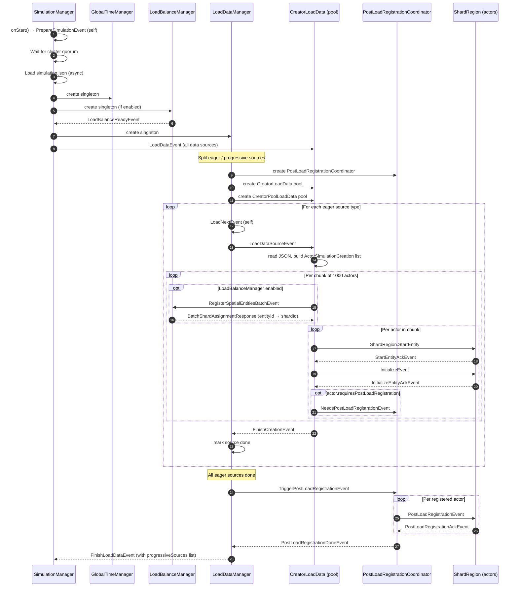
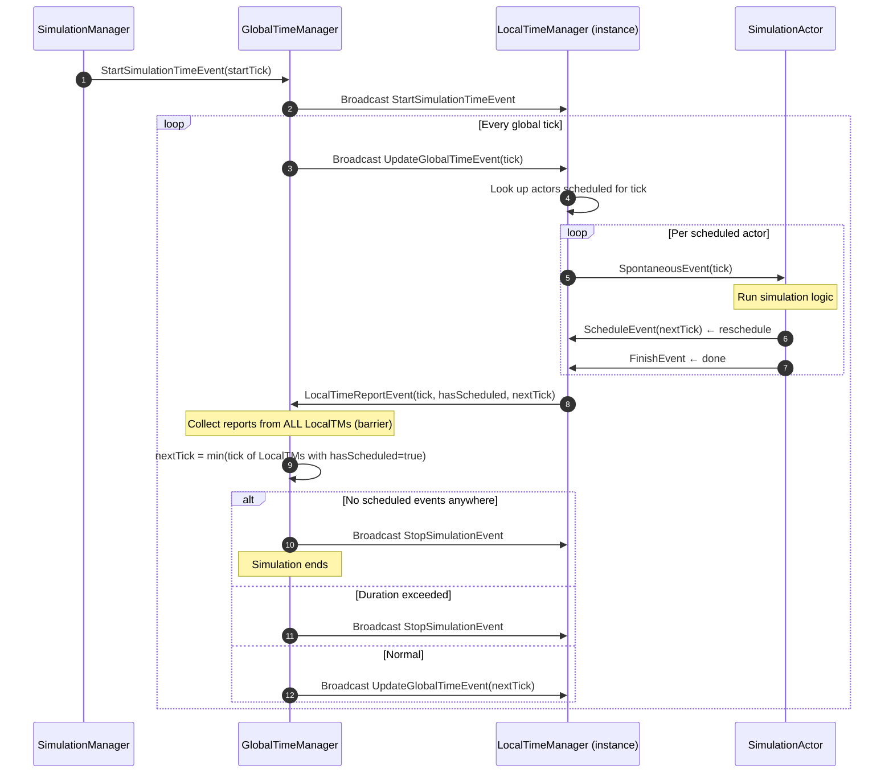
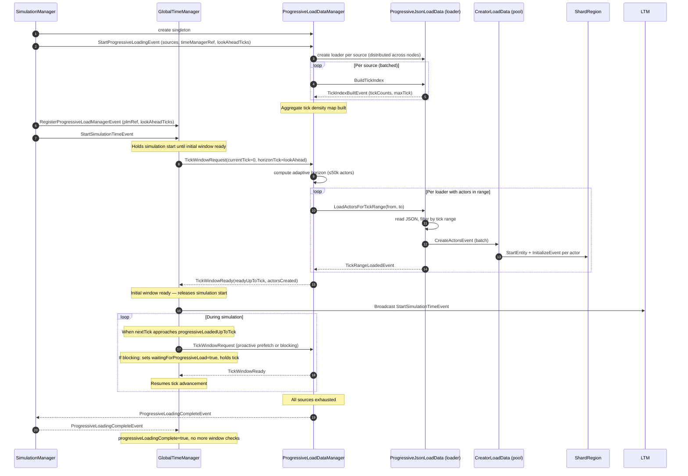
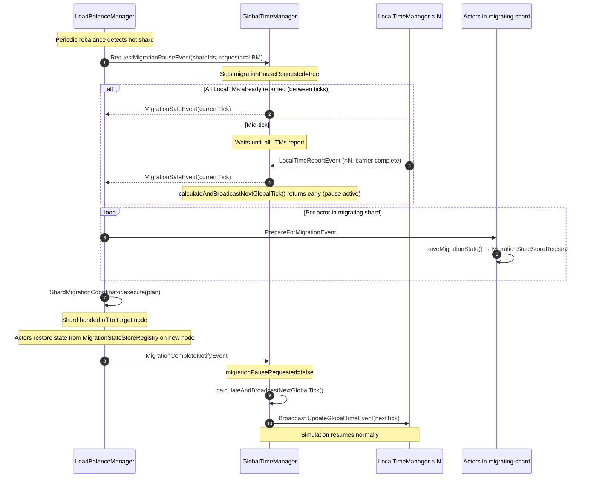
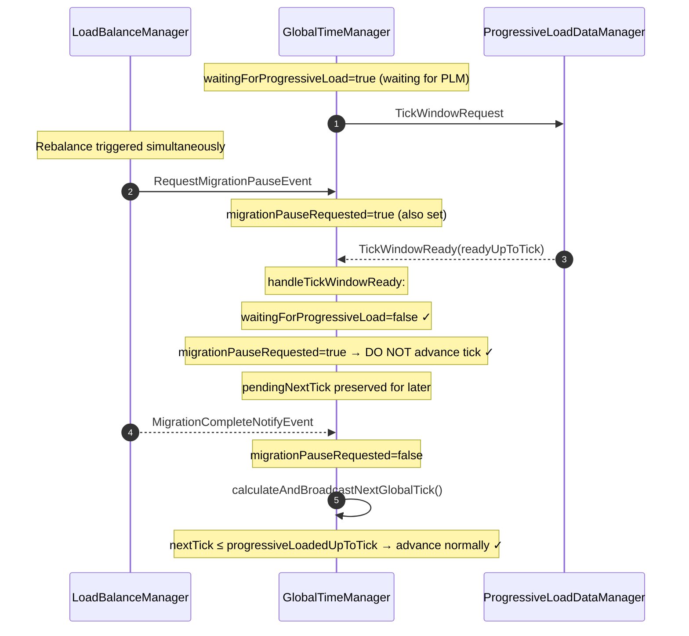

# System Managers Reference

> Hyperbolic Time Chamber — Managers, Load Pipeline, Time Coordination, Load Balance

---

## Table of Contents

1. [Architecture Overview](#1-architecture-overview)
2. [SimulationManager](#2-simulationmanager)
3. [Load Pipeline](#3-load-pipeline)
   - [LoadDataManager](#31-loaddatamanager)
   - [CreatorLoadData](#32-creatorloaddata)
   - [CreatorPoolLoadData](#33-creatorpoolloaddata)
   - [PostLoadRegistrationCoordinator](#34-postloadregistrationcoordinator)
   - [ProgressiveLoadDataManager](#35-progressiveloaddatamanager)
4. [Time Management](#4-time-management)
   - [TimeManagerBase](#41-timemanagerbase)
   - [GlobalTimeManager](#42-globaltimemanager)
   - [LocalDiscreteEventTimeManager](#43-localdiscreteeventtimemanager)
5. [Load Balance Manager](#5-load-balance-manager)
6. [Event Catalogue](#6-event-catalogue)
7. [Sequence Diagrams](#7-sequence-diagrams)
   - [System Bootstrap & Eager Loading](#71-system-bootstrap--eager-loading)
   - [Simulation Tick Loop](#72-simulation-tick-loop)
   - [Progressive Loading (mid-simulation)](#73-progressive-loading-mid-simulation)
   - [Load Balance Migration](#74-load-balance-migration)
   - [Migration + Progressive Load (concurrent)](#75-migration--progressive-load-concurrent)

---

## 1. Architecture Overview

```
┌──────────────────────────────────────────────────────────────────┐
│                        Cluster Singleton Layer                   │
│  SimulationManager                                               │
│    ├── GlobalTimeManager  ──────────────── LocalTM × N (pool)   │
│    ├── LoadDataManager    ──────────────── CreatorLoadData × N   │
│    │                      ──────────────── CreatorPoolLoadData×N │
│    │                      └─ PostLoadRegistrationCoordinator     │
│    ├── ProgressiveLoadDataManager ──────── ProgressiveLoader × M │
│    │                      ──────────────── CreatorLoadData × N   │
│    ├── LoadBalanceManager                                        │
│    └── ReportManager                                             │
└──────────────────────────────────────────────────────────────────┘
```

All managers are **Cluster Singletons** — one instance per cluster, accessed through a singleton proxy.  
Actors created during loading are **Cluster Shards** — distributed across all pods by `ClusterSharding`.

---

## 2. SimulationManager

**File:** `core/actor/manager/SimulationManager.scala`  
**Role:** Root orchestrator. Creates all other managers, sequences the bootstrap phases, and shuts everything down.

### Lifecycle

| Phase | Trigger | Action |
|-------|---------|--------|
| **Startup** | `onStart()` | Sends `PrepareSimulationEvent` to self via singleton proxy |
| **Prepare** | `PrepareSimulationEvent` | Waits for cluster quorum, loads `simulation.json` asynchronously |
| **Config loaded** | `SimulationConfigLoadedEvent` | Creates TimeManager, ReportManager, LoadBalanceManager (if enabled), LoadManager |
| **Data loaded** | `FinishLoadDataEvent` | Destroys LoadDataManager, creates ProgressiveLoadDataManager (if progressive sources), sends `StartSimulationTimeEvent` to GlobalTimeManager |
| **Progressive complete** | `ProgressiveLoadingCompleteEvent` | Notifies GlobalTimeManager, metrics |
| **Stop** | `StopSimulationEvent` | Sends `StopSimulationEvent` to all managers |

### Key Fields

| Field | Type | Purpose |
|-------|------|---------|
| `timeSingletonManager` | `ActorRef` | GlobalTimeManager singleton |
| `poolTimeManager` | `ActorRef` | LocalTM pool router (for actor registration) |
| `loadManager` | `ActorRef` | LoadDataManager singleton |
| `loadBalanceManager` | `ActorRef` | LoadBalanceManager singleton (optional) |
| `progressiveLoadManager` | `ActorRef` | ProgressiveLoadDataManager singleton (optional) |
| `configuration` | `Simulation` | Parsed `simulation.json` |

### Initialization Guard

SimulationManager retries `PrepareSimulationEvent` with backoff until the cluster has enough members (configurable). This prevents starting on a single-pod cluster when a multi-node setup is expected.

---

## 3. Load Pipeline

### 3.1 LoadDataManager

**File:** `core/actor/manager/load/LoadDataManager.scala`  
**Role:** Coordinates **eager** (pre-simulation) loading of all actor data sources. Destroyed after loading completes.

#### Responsibilities

- Receives `LoadDataEvent` from SimulationManager with the list of all data sources
- Splits sources into **eager** (start immediately) and **progressive** (deferred)
- Creates `CreatorLoadData` and `CreatorPoolLoadData` pool actors
- Dispatches `LoadDataSourceEvent` to each creator, one source at a time (`LoadNextEvent` pattern)
- Creates and manages the `PostLoadRegistrationCoordinator`
- Sends `FinishLoadDataEvent` to SimulationManager when all eager sources finish

#### Stuck Source Detection

A periodic `StuckSourceWatchdog` fires every 60 s. If a source type has been in `sourcesInCreation` for:
- **> 3 minutes** → `logWarn`
- **> 10 minutes** → force-unblock and continue (prevents simulation deadlock)

#### Flow

```
LoadDataEvent
  → split eager / progressive
  → create PostLoadRegistrationCoordinator
  → create CreatorLoadData pool
  → create CreatorPoolLoadData pool
  → LoadNextEvent loop:
      for each source type:
        CreatorLoadData/Pool ! LoadDataSourceEvent
        wait for FinishLoadDataEvent from creator
  → all eager done → TriggerPostLoadRegistrationEvent → coordinator
  → PostLoadRegistrationDoneEvent → sendFinishToSimulationManager
  → FinishLoadDataEvent → SimulationManager
```

#### Key State

| Field | Purpose |
|-------|---------|
| `sourcesToCreate` | Queue of remaining source types to dispatch |
| `sourcesInCreation` | Sources currently being loaded (for stuck detection) |
| `progressiveSources` | Sources forwarded to ProgressiveLoadDataManager |
| `postLoadCoordinator` | PostLoadRegistrationCoordinator actor ref |

---

### 3.2 CreatorLoadData

**File:** `core/actor/manager/load/CreatorLoadData.scala`  
**Role:** Creates **shard-distributed** (`LoadBalancedDistributed`) actors from a data source. One pool instance per `LoadDataManager`, shared across source types.

#### Responsibilities

- Receives `CreateActorsEvent` from loaders with a batch of `ActorSimulationCreation`
- Chunks actors into groups of 1000 (`CREATE_CHUNK_SIZE`) to avoid mailbox overflow
- For each chunk: optionally requests spatial shard assignment from `LoadBalanceManager` via `RegisterSpatialEntitiesBatchEvent`
- Sends `ShardRegion.StartEntity` per actor and waits for `StartEntityAckEvent`
- On ACK: builds `InitializeEvent` and sends it to the shard region
- Waits for `InitializeEntityAckEvent` per actor
- Retries pending ACKs every 30 s via `RetryPendingAcks` watchdog
- Forwards `NeedsPostLoadRegistrationEvent` to the `PostLoadRegistrationCoordinator`
- Sends `FinishCreationEvent` when all actors in a batch are initialized

#### Spatial Shard Assignment

If `LoadBalanceManager` is enabled, `CreatorLoadData` lazily obtains a singleton proxy and sends a `RegisterSpatialEntitiesBatchEvent` per chunk. The response (`BatchShardAssignmentResponse`) provides spatial shard IDs that override the default hash-based routing. This ensures spatially close actors end up in the same shard (and thus the same JVM/pod).

#### State

| Field | Purpose |
|-------|---------|
| `initializeData` | `batchId → entityId → Initialization` waiting for StartEntityAck |
| `pendingInitAck` | `entityId → Initialization` waiting for InitializeEntityAck |
| `actorsBatches` | `entityId → batchId` reverse index |
| `pendingChunks` | `batchId → chunk` waiting for BatchShardAssignmentResponse |
| `actorsToCreate` | Remaining actors per batch (chunked) |

---

### 3.3 CreatorPoolLoadData

**File:** `core/actor/manager/load/CreatorPoolLoadData.scala`  
**Role:** Creates **pool-distributed** (`PoolDistributed`) actors (e.g., time managers that use Pekko routers instead of shards). Logic is similar to `CreatorLoadData` but routes via pool instead of shard region.

---

### 3.4 PostLoadRegistrationCoordinator

**File:** `core/actor/manager/load/PostLoadRegistrationCoordinator.scala`  
**Role:** Orchestrates the two-phase post-load registration. Created once per loading cycle, self-destructs after completion.

#### Two-Phase Design

**Phase 1 — Accumulation** (during eager loading):  
Creators forward `NeedsPostLoadRegistrationEvent` directly to the coordinator for any actor that overrides `requiresPostLoadRegistration = true`. Classes listed in `simulation.json → postLoadRegistrationClasses` are auto-forwarded without modifying their actor code.

**Phase 2 — Fan-out** (after all eager loading):  
`LoadDataManager` sends `TriggerPostLoadRegistrationEvent`. The coordinator fans out `PostLoadRegistrationEvent` to all accumulated entities and waits for `PostLoadRegistrationAckEvent` from each. After MAX_RETRIES (12 × 10 s = 120 s), the coordinator proceeds regardless to prevent deadlock.

#### Why It Exists

Some actors need to resolve cross-actor dependencies (e.g., BusStop → Node) that are only fully loaded after all eager sources complete. The two-phase design guarantees all dependencies exist before any actor runs its post-load logic.

---

### 3.5 ProgressiveLoadDataManager

**File:** `core/actor/manager/load/ProgressiveLoadDataManager.scala`  
**Role:** Creates actors from **progressive** sources during simulation runtime, tick-window by tick-window. Runs as a Cluster Singleton alongside `GlobalTimeManager`.

#### Key Concepts

**Tick-window loading:** The GlobalTimeManager sends `TickWindowRequest(currentTick, horizonTick)`. The PLM ensures all actors with `startTick ≤ horizonTick` are created before the simulation reaches those ticks.

**Adaptive window sizing:** Each source builds a tick-density index (`TickIndexBuiltEvent`). PLM aggregates counts across all sources and computes the horizon dynamically: it loads a window containing at most `TARGET_ACTORS_PER_WINDOW = 50,000` actors, respecting `MIN_LOOK_AHEAD_TICKS = 100`.

**Index build batching:** Index builds are batched (`INDEX_BUILD_BATCH_SIZE = 30`) to avoid I/O contention.

**Load batching:** File re-reads are batched (`LOAD_BATCH_SIZE = 10`) to limit concurrent memory pressure.

**Distributed loaders:** Each `ProgressiveJsonLoadData` loader is deployed remotely on a specific cluster node (round-robin), distributing JSON parsing across pods.

**Own creator pools:** PLM creates its own `CreatorLoadData` and `CreatorPoolLoadData` pools (independent from LoadDataManager's pools, which are destroyed after eager loading).

#### Flow

```
StartProgressiveLoadingEvent (from SimulationManager)
  → create loader actors (distributed across nodes)
  → build tick index (batched)

TickWindowRequest (from GlobalTimeManager, periodically)
  → compute adaptive horizon
  → LoadActorsForTickRange → each ProgressiveJsonLoadData loader
  → each loader → CreateActorsEvent → CreatorLoadData
  → all loaders report TickRangeLoadedEvent
  → TickWindowReady → GlobalTimeManager

(when all sources exhausted)
  → ProgressiveLoadingCompleteEvent → SimulationManager → GlobalTimeManager
```

#### State

| Field | Purpose |
|-------|---------|
| `loadedUpToTick` | Last tick up to which actors have been created |
| `pendingWindowRequest` | Current in-flight window request |
| `pendingRangeResponses` | Per-source load completion tracking |
| `aggregatedTickCounts` | Tick density map for adaptive windowing |
| `loadInFlight` | Gate to prevent concurrent window loads |

---

## 4. Time Management

### 4.1 TimeManagerBase

**File:** `core/actor/manager/time/TimeManagerBase.scala`  
**Role:** Abstract base for all time managers. Defines the common state and the message contract.

| Abstract method | Implemented by |
|----------------|----------------|
| `startSimulation` | GlobalTimeManager, LocalDiscreteEventTimeManager |
| `registerActor` | LocalDiscreteEventTimeManager |
| `scheduleEvent` | Both |
| `finishEvent` | LocalDiscreteEventTimeManager |
| `sendSpontaneousEvent` | LocalDiscreteEventTimeManager |
| `advanceToNextTick` | LocalDiscreteEventTimeManager |
| `nextTick` | Both |

---

### 4.2 GlobalTimeManager

**File:** `core/actor/manager/time/GlobalTimeManager.scala`  
**Role:** Cluster Singleton that acts as the global tick barrier. Coordinates all `LocalDiscreteEventTimeManager` instances and controls when the simulation advances.

#### Core Mechanism

Every global tick follows this protocol:

1. GTM broadcasts `UpdateGlobalTimeEvent(nextTick)` to all LocalTMs via `Broadcast`
2. Each LocalTM processes all spontaneous events scheduled for `nextTick` and sends `LocalTimeReportEvent(tick, hasScheduled)` back
3. GTM collects reports from **all** registered LocalTMs (barrier)
4. GTM computes `nextTick = min(tick of LocalTMs that have scheduled events)`
5. GTM broadcasts `UpdateGlobalTimeEvent(nextTick)` — repeat

#### Key Fields

| Field | Purpose |
|-------|---------|
| `localTimeManagers` | Map of LocalTM → `LocalTimeManagerTickInfo` (tick, hasSchedule, isProcessed) |
| `timeManagersPool` | ClusterRouterPool for LocalTMs |
| `migrationPauseRequested` | Blocks tick advancement during shard migration |
| `migrationRequester` | LoadBalanceManager that requested the pause |
| `progressiveLoadingEnabled` | Whether PLM is active |
| `progressiveLoadedUpToTick` | Last tick confirmed loaded by PLM |
| `waitingForProgressiveLoad` | Blocks tick advancement while PLM loads a window |
| `pendingNextTick` | Tick to resume to after PLM responds |
| `waitingForInitialWindow` | Blocks simulation start until first PLM window ready |

#### Pool Configuration

Pool size is read from `application.conf`:
```
htc.time-manager.total-instances
htc.time-manager.max-instances-per-node
```

Each LocalTM instance registers itself with GTM via `TimeManagerRegisterEvent`. GTM also watches each LocalTM (`context.watch`) and removes crashed TMs from the barrier map via `Terminated`.

#### Termination

Simulation terminates when:
- All LocalTMs report `hasSchedule = false` (no more events)
- OR `localTickOffset - initialTick >= simulationDuration` (when `extendSimulationIfPendingEventsAfterEnd = false`)

---

### 4.3 LocalDiscreteEventTimeManager

**File:** `core/actor/manager/time/LocalDiscreteEventTimeManager.scala`  
**Role:** Processes scheduled spontaneous events for a subset of actors. Multiple instances run in parallel (pool), each handling a portion of the actor population.

#### Actor Registration

Simulation actors call `RegisterActorEvent` to register with a LocalTM. The round-robin pool distributes registrations evenly. Each actor is stored in `scheduledActors: Map[Tick, Set[Identify]]`.

#### Tick Execution

On `UpdateGlobalTimeEvent(tick)`:
1. Look up all actors scheduled for `tick`
2. Send `SpontaneousEvent(tick, actorRef)` to each
3. Track running events in `runningEvents`
4. On each `FinishEvent`: remove from `runningEvents`; if all done, find `nextTick` and send `LocalTimeReportEvent`

#### Schedule Events

`ScheduleEvent` from an actor reschedules it for a future tick. The actor always sends this from its `onSpontaneousEvent` handler.

---

## 5. Load Balance Manager

**File:** `core/actor/manager/loadbalance/LoadBalanceManager.scala`  
**Role:** Cluster Singleton that maintains a spatial index of all actors and periodically rebalances shard distribution to minimize cross-node communication.

### Spatial Partitioning

On creation, each actor's spatial position (lat/lon for nodes, derived for cars) is registered via `RegisterSpatialEntitiesBatchEvent`. The LBM assigns a **shard ID** based on the configured strategy (e.g., Quadtree spatial partitioning). This shard ID routes the actor to a specific JVM/pod, keeping spatially close actors co-located.

### Strategies

| Strategy | Description |
|----------|-------------|
| `QUADTREE` | Recursively subdivides world bounds; spatially close actors in the same quadrant → same shard |
| `ROUND_ROBIN` | Default fallback, no spatial awareness |

### Migration Protocol

When the LBM decides to migrate a shard to another node:

1. LBM → GTM: `RequestMigrationPauseEvent(shardIds, requester=self)`
2. GTM finishes current tick's events; all LocalTMs report
3. GTM → LBM: `MigrationSafeEvent(currentTick)` — safe to migrate
4. LBM → each actor in shard: `PrepareForMigrationEvent` (actor serializes state to `MigrationStateStoreRegistry`)
5. LBM coordinates `ShardMigrationCoordinator` to hand off shard
6. LBM → GTM: `MigrationCompleteNotifyEvent` — resume simulation

### Load Metrics

Actors report `UpdateLoadMetricsEvent` periodically. LBM feeds these into the strategy, which tracks load per shard and node. Periodic rebalancing and metrics collection are scheduled via cancellable tasks.

### Interaction with Creators

`CreatorLoadData` (both eager and progressive) lazily discovers the LBM via singleton proxy and sends `RegisterSpatialEntitiesBatchEvent` per chunk. The LBM responds with `BatchShardAssignmentResponse(assignments: Map[entityId → shardId])`, which the creator uses to route actors to the correct shard region.

---

## 6. Event Catalogue

### Load Pipeline Events

| Event | From → To | Purpose |
|-------|-----------|---------|
| `LoadDataEvent` | SimulationManager → LoadDataManager | Start loading with all data sources |
| `LoadDataSourceEvent` | LoadDataManager → Creator | Load a specific data source file |
| `CreateActorsEvent` | Loader → Creator | Batch of actors to create |
| `ProcessNextCreateChunk` | Creator → self | Self-message to process next actor chunk |
| `FinishCreationEvent` | Creator → LoadDataManager | Batch done |
| `FinishLoadDataEvent` | LoadDataManager → SimulationManager | All eager sources done |
| `LoadNextEvent` | LoadDataManager → self | Trigger loading next pending source |
| `InitializeEvent` | Creator → ShardRegion | Initialize a specific actor |
| `RetryPendingAcks` | Creator → self (periodic) | Retry unacknowledged actors |
| `NeedsPostLoadRegistrationEvent` | Creator → PostLoadCoordinator | Actor opted in to post-load phase |
| `TriggerPostLoadRegistrationEvent` | LoadDataManager → PostLoadCoordinator | Start fan-out phase |
| `PostLoadRegistrationEvent` | PostLoadCoordinator → Actor | Trigger actor's post-load logic |
| `PostLoadRegistrationAckEvent` | Actor → PostLoadCoordinator | Post-load logic complete |
| `PostLoadRegistrationDoneEvent` | PostLoadCoordinator → LoadDataManager | All post-load registrations done |

### Progressive Loading Events

| Event | From → To | Purpose |
|-------|-----------|---------|
| `StartProgressiveLoadingEvent` | SimulationManager → PLM | Initialize progressive loading |
| `BuildTickIndex` | PLM → ProgressiveJsonLoadData | Build tick-density index |
| `TickIndexBuiltEvent` | ProgressiveJsonLoadData → PLM | Index ready |
| `TickWindowRequest` | GlobalTimeManager → PLM | Request actors up to horizonTick |
| `LoadActorsForTickRange` | PLM → ProgressiveJsonLoadData | Load actors in tick range |
| `TickRangeLoadedEvent` | ProgressiveJsonLoadData → PLM | Source loaded its range |
| `TickWindowReady` | PLM → GlobalTimeManager | Actors are ready, safe to advance |
| `RegisterProgressiveLoadManagerEvent` | SimulationManager → GlobalTimeManager | Register PLM reference + lookAheadTicks |
| `ProgressiveLoadingCompleteEvent` | PLM → SimulationManager → GlobalTimeManager | All progressive sources exhausted |

### Time Management Events

| Event | From → To | Purpose |
|-------|-----------|---------|
| `StartSimulationTimeEvent` | SimulationManager → GlobalTimeManager | Start simulation at tick N |
| `UpdateGlobalTimeEvent(tick)` | GlobalTimeManager → LocalTMs (Broadcast) | Advance to tick |
| `LocalTimeReportEvent` | LocalTM → GlobalTimeManager | Tick done; nextTick; hasScheduled |
| `RegisterActorEvent` | SimulationActor → LocalTM | Register actor for scheduling |
| `ScheduleEvent` | SimulationActor → LocalTM | Schedule actor for future tick |
| `SpontaneousEvent` | LocalTM → SimulationActor | Time to run! |
| `FinishEvent` | SimulationActor → LocalTM | Spontaneous event handled |
| `TimeManagerRegisterEvent` | LocalTM → GlobalTimeManager | Register LocalTM in barrier map |

### Load Balance Events

| Event | From → To | Purpose |
|-------|-----------|---------|
| `LoadBalanceReadyEvent` | LoadBalanceManager → SimulationManager | LBM initialized and ready |
| `RegisterSpatialEntitiesBatchEvent` | Creator → LoadBalanceManager | Register batch for spatial shard assignment |
| `BatchShardAssignmentResponse` | LoadBalanceManager → Creator | Shard IDs per entity |
| `UpdateLoadMetricsEvent` | SimulationActor → LoadBalanceManager | Report load metrics |
| `RequestMigrationPauseEvent` | LoadBalanceManager → GlobalTimeManager | Pause tick advancement for migration |
| `MigrationSafeEvent` | GlobalTimeManager → LoadBalanceManager | Safe to start migration |
| `PrepareForMigrationEvent` | LoadBalanceManager → SimulationActor | Actor: serialize state |
| `MigrationCompleteEvent` | ShardMigrationCoordinator → LoadBalanceManager | Shard migration done |
| `MigrationCompleteNotifyEvent` | LoadBalanceManager → GlobalTimeManager | Resume tick advancement |

---

## 7. Sequence Diagrams

### 7.1 System Bootstrap & Eager Loading



---

### 7.2 Simulation Tick Loop



---

### 7.3 Progressive Loading (mid-simulation)



---

### 7.4 Load Balance Migration



---

### 7.5 Migration + Progressive Load (concurrent)

This diagram shows the correct ordering when a `TickWindowReady` from PLM arrives while a migration pause is active — a race condition fixed in the codebase.



---

*Last updated: April 2026*
